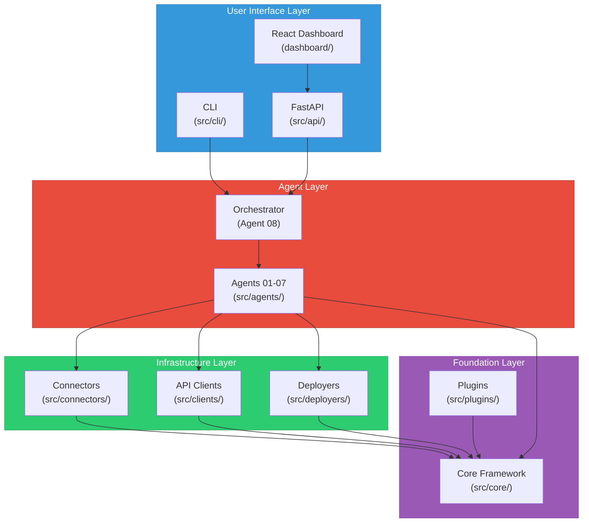
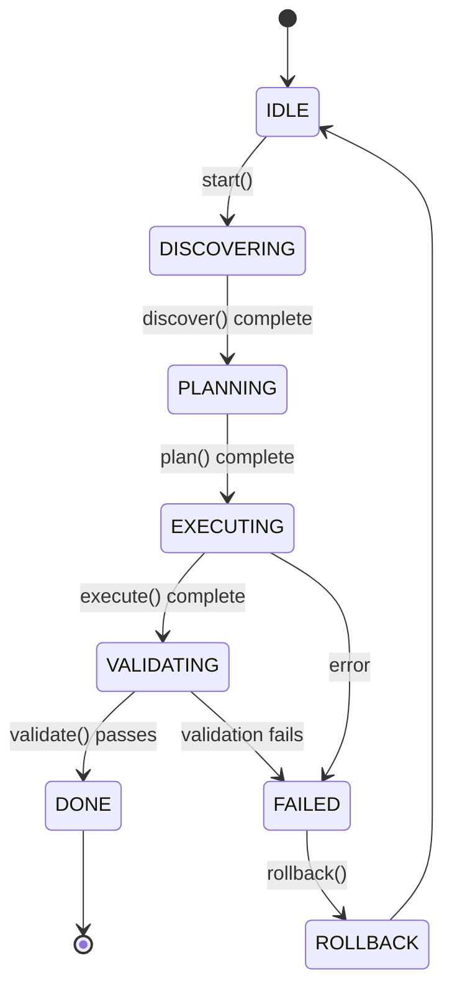
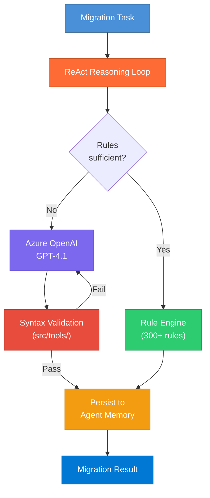
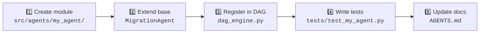
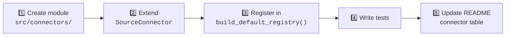

<h1 align="center">🤝 Contributing Guide</h1>
<h3 align="center">OAC → Microsoft Fabric & Power BI Migration</h3>

<p align="center">
  Thank you for your interest in contributing!<br/>
  This guide covers architecture, conventions, and workflow.
</p>

---

## 📑 Table of Contents

- [Architecture](#-architecture)
- [Project Structure](#-project-structure)
- [Development Setup](#-development-setup)
- [Extending the Framework](#-extending-the-framework)
- [Testing](#-testing)
- [Code Style](#-code-style)
- [Pull Request Process](#-pull-request-process)

---

## 🏗️ Architecture

The framework has **four main layers** — understand these before making changes:



### Agent Lifecycle

Every agent follows the same contract:



```python
class MigrationAgent(ABC):
    """Base class — all agents implement these four methods."""
    async def discover(self, scope) -> Inventory
    async def plan(self, inventory) -> MigrationPlan
    async def execute(self, plan) -> MigrationResult
    async def validate(self, result) -> ValidationReport
```

### Connector Interface

Source connectors follow a separate contract:

```python
class SourceConnector(ABC):
    """Base class — all connectors implement these methods."""
    def info() -> ConnectorInfo
    async def connect(config) -> bool
    async def discover() -> list[ExtractedAsset]
    async def extract_metadata(ids) -> ExtractionResult
    async def disconnect()
```

### v8.0 Intelligence Layer

Each agent's rule engine is now wrapped by an optional LLM reasoning loop:



---

## 📂 Project Structure

```
OACToFabric/
├── 🐍 src/
│   ├── core/                    # 40 modules — config, models, LLM, telemetry,
│   │                            #   resilience, checkpoints, caching, security,
│   │                            #   intelligence (reasoning loop, agent memory)
│   ├── agents/                  # 8 migration agents
│   │   ├── discovery/           # OAC crawling, RPD parsing, dependency graph
│   │   ├── schema/              # DDL generation, type mapping, SQL translation
│   │   ├── etl/                 # Dataflow → pipeline, PL/SQL → PySpark
│   │   ├── semantic/            # RPD → TMDL, expressions → DAX, hierarchies
│   │   ├── report/              # Visuals, layouts, prompts → slicers (PBIR)
│   │   ├── security/            # Roles → RLS/OLS, workspace permissions
│   │   ├── validation/          # Data reconciliation, semantic + report checks
│   │   └── orchestrator/        # DAG engine, wave planner, notifications
│   ├── api/                     # FastAPI (REST + WS + SSE) + JWT/RBAC auth
│   ├── cli/                     # argparse CLI — 5 commands
│   ├── clients/                 # OAC, Fabric, Power BI API clients
│   ├── connectors/              # Multi-source: OAC, OBIEE, Tableau, Cognos, Qlik
│   ├── deployers/               # Fabric, PBI, Pipeline deployers
│   ├── plugins/                 # Plugin framework & manager
│   ├── testing/                 # Integration test harness, fixture generators
│   ├── tools/                   # 5 practical migration tools (DAX validator,
│   │                            #   TMDL validator, reconciliation CLI,
│   │                            #   OAC test harness, Fabric dry-run)
│   └── validation/              # Visual diff, data quality checks
│
├── ⚛️  dashboard/                # React 18 + Vite + TypeScript SPA
├── 🧪 tests/                    # 3,760 tests across 140+ files
├── ⚙️  config/                   # TOML configs (dev, migration, prod)
├── 🏗️  infra/                    # Bicep IaC for Azure resources
├── 📚 docs/                     # ADRs, runbooks, API reference
├── 📋 agents/                   # Agent SPEC documents (01–08)
├── 🔧 scripts/                  # Dev setup, deployment scripts
└── 📝 templates/                # Migration checklists
```

---

## 🛠️ Development Setup

### Prerequisites

| Tool | Version | Purpose |
|:-----|:--------|:--------|
| Python | 3.12+ (3.14 recommended) | Backend, agents, CLI |
| Node.js | 20+ | React dashboard |
| Git | Latest | Version control |
| VS Code | Latest | Recommended editor |

### Quick Start

```bash
# Clone
git clone <repo-url>
cd OACToFabric

# Python setup
python -m venv .venv
.venv\Scripts\activate          # Windows
# source .venv/bin/activate     # macOS/Linux
pip install -e ".[dev]"

# Dashboard setup
cd dashboard
npm install
npm run dev                     # → http://localhost:5173

# Run tests
cd ..
python -m pytest tests/ -v      # → 3,760 passed
```

### Environment Variables

Copy `.env.example` to `.env` for live testing (not needed for unit tests):

```bash
cp .env.example .env
# Fill in: OAC_URL, FABRIC_WORKSPACE_ID, OPENAI_ENDPOINT, etc.
```

---

## 🧩 Extending the Framework

### Adding a New Agent



1. Create `src/agents/my_agent/__init__.py` + `my_agent.py`
2. Inherit from `MigrationAgent` and implement `discover`, `plan`, `execute`, `validate`
3. Register in the orchestrator DAG in `dag_engine.py`
4. Write comprehensive tests
5. Update `AGENTS.md` with the agent's responsibilities

### Adding a New Connector



1. Create `src/connectors/my_connector.py`
2. Implement `info()`, `connect()`, `discover()`, `extract_metadata()`, `disconnect()`
3. Add to `build_default_registry()` in `base_connector.py`
4. Write tests following `test_phase40_tableau.py` as a template
5. Update connector status table in README

### Adding Translation Rules

Add new expression mappings to the relevant translator:

| Source | File | Format |
|:-------|:-----|:-------|
| OAC → DAX | `src/core/translation_catalog.py` | `(oac_func, dax_func, notes)` |
| Tableau → DAX | `src/connectors/tableau_connector.py` | `(regex_pattern, replacement, type)` |
| SQL → Fabric SQL | `src/agents/schema/sql_translator.py` | Rule-based patterns |

---

## 🧪 Testing

### Running Tests

```bash
# All tests (fast — ~20s)
python -m pytest tests/ -v

# Specific test file
python -m pytest tests/test_phase40_tableau.py -v

# By marker
python -m pytest tests/ -m "asyncio" -v

# With coverage
python -m pytest tests/ --cov=src --cov-report=html
```

### Test Conventions

| Convention | Example |
|:-----------|:--------|
| One test file per source module | `schema_agent.py` → `test_schema_agent.py` |
| Phase tests for large features | `test_phase40_tableau.py` |
| Descriptive test names | `test_discovers_physical_tables_from_rpd_xml` |
| Classes group related tests | `class TestTableauCalcTranslator:` |
| `pytest-asyncio` for async | Auto-configured via `pyproject.toml` |
| No external deps | All APIs mocked — tests work fully offline |

### Test Stats

```
📊 3,760 passed, 2 skipped, 0 failures
⏱️  ~40 seconds on standard hardware
📁 140+ test files
```

---

## 🎨 Code Style

### Rules

| Rule | Standard |
|:-----|:---------|
| **Type hints** | All functions — complete annotations |
| **Docstrings** | Google-style on public APIs |
| **Line length** | 88 chars (Black default) |
| **Imports** | stdlib → third-party → local (blank line between) |
| **Async** | `async/await` for all I/O-bound ops |
| **Models** | Pydantic for cross-agent data structures |
| **Logging** | `logging.getLogger(__name__)` in every module |

### Tools

```bash
black src/ tests/        # Format
ruff check src/ tests/   # Lint
mypy src/                # Type check
```

---

## 🔀 Pull Request Process

```mermaid
gitgraph
    commit id: "main"
    branch feature/my-change
    commit id: "implement"
    commit id: "add tests"
    commit id: "update docs"
    checkout main
    merge feature/my-change id: "PR merged ✅"
    commit id: "release"
```

### Branching Strategy

| Branch Pattern | Purpose | Example |
|:---------------|:--------|:--------|
| `main` | Stable release branch | — |
| `feature/<name>` | New feature development | `feature/agent-09-custom` |
| `fix/<name>` | Bug fixes | `fix/calc-translation` |
| `docs/<name>` | Documentation updates | `docs/update-mapping-ref` |
| `release/vX.Y.Z` | Release candidates | `release/v4.0.0` |

### Steps

1. **Branch** from `main`: `feature/agent-09-custom` or `fix/calc-translation`
2. **Implement** — code + tests following conventions above
3. **Test** — all 3,760+ tests must pass: `python -m pytest tests/ -v`
4. **Document** — update relevant docs, ADRs, CHANGELOG
5. **PR** — clear description, link to Phase/Sprint in DEV_PLAN.md
6. **Review** — at least one reviewer required
7. **CI** — all checks pass (tests, lint, type check)

### File Ownership

Each source file has **one owning agent**. Only the owning agent should modify its files. See [AGENTS.md](AGENTS.md) for the complete file ownership table and handoff protocol.

---

## 🔒 Release Process

1. Create `release/vX.Y.Z` branch from `main`
2. Update version in `pyproject.toml`
3. Update `CHANGELOG.md` with release notes
4. Run full test suite + linting + type checking
5. PR into `main` → merge
6. Tag `vX.Y.Z` → triggers CI/CD deployment

---

## ❓ Questions?

| Resource | Location |
|:---------|:---------|
| Architecture | `docs/ARCHITECTURE.md` |
| Deployment guide | `docs/DEPLOYMENT_GUIDE.md` |
| Mapping reference | `docs/MAPPING_REFERENCE.md` |
| Known limitations | `docs/KNOWN_LIMITATIONS.md` |
| FAQ | `docs/FAQ.md` |
| Gap analysis | `docs/GAP_ANALYSIS.md` |
| Operational runbooks | `docs/runbooks/` |
| Architecture decisions | `docs/adrs/` |
| API notes | `docs/oac-api-notes.md` |
| Security setup | `docs/security.md` |
| Agent specs | `agents/01-discovery-agent/SPEC.md` … `agents/08-orchestrator-agent/` |
| Agent ownership & handoffs | `AGENTS.md` |

---

<p align="center">
  <sub>Thank you for contributing! 🙌</sub>
</p>
