<h1 align="center">📋 Migration Playbook</h1>
<h3 align="center">OAC → Microsoft Fabric & Power BI</h3>

<p align="center">
  Step-by-step production migration guide.<br/>
  Covers prerequisites, all 8 migration phases, validation, and go-live.
</p>

---

## 🗺️ Migration Journey

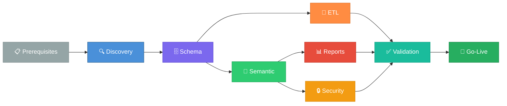

---

## 📑 Table of Contents

1. [Prerequisites](#1--prerequisites)
2. [Environment Setup](#2--environment-setup)
3. [Phase 1 — Discovery](#3--phase-1--discovery)
4. [Phase 2 — Schema Migration](#4--phase-2--schema-migration)
5. [Phase 3 — ETL Pipeline Migration](#5--phase-3--etl-pipeline-migration)
6. [Phase 4 — Semantic Model Migration](#6--phase-4--semantic-model-migration)
7. [Phase 5 — Report Migration](#7--phase-5--report-migration)
8. [Phase 6 — Security Migration](#8--phase-6--security-migration)
9. [Phase 7 — Validation](#9--phase-7--validation)
10. [Phase 8 — Cutover & Go-Live](#10--phase-8--cutover--go-live)
11. [Troubleshooting](#11--troubleshooting)

---

## 1. 📦 Prerequisites

### Source Environment (Oracle)

| Requirement | Details |
|:------------|:--------|
| ☐ OAC Instance | URL + admin credentials (IDCS) |
| ☐ RPD Export | XML format from OAC admin console |
| ☐ Oracle Database | Connection details for physical data layer |
| ☐ Application Roles | Full list of OAC roles + user mappings |
| ☐ Data Flows | Exported data flow definitions |

### Target Environment (Microsoft)

| Requirement | Details |
|:------------|:--------|
| ☐ Azure Subscription | With Fabric capacity (F2 or higher) |
| ☐ Fabric Workspace | Created and configured |
| ☐ Power BI Licenses | Pro or Premium Per User for creators |
| ☐ Azure AD | Tenant with groups mapped to OAC roles |
| ☐ Azure Key Vault | For secret management |
| ☐ Azure OpenAI | GPT-4 deployment for LLM-assisted translation |

### Tool Setup

```bash
# Python 3.12+ required
python -m venv .venv
.venv\Scripts\activate          # Windows
# source .venv/bin/activate     # macOS/Linux
pip install -e .
```

---

## 2. ⚙️ Environment Setup

### 2.1 Configure Secrets

Store credentials in Azure Key Vault (**never** in config files):

```bash
az keyvault secret set --vault-name <vault> --name oac-url         --value "https://your-oac.analytics.ocp.oraclecloud.com"
az keyvault secret set --vault-name <vault> --name oac-client-id    --value "<idcs-client-id>"
az keyvault secret set --vault-name <vault> --name oac-client-secret --value "<idcs-client-secret>"
az keyvault secret set --vault-name <vault> --name fabric-sql-endpoint --value "<lakehouse-sql-endpoint>"
az keyvault secret set --vault-name <vault> --name openai-api-key   --value "<api-key>"
```

### 2.2 Configure `migration.toml`

```toml
[migration]
name = "OAC_to_Fabric_2025"
waves = 3

[oac]
url = "https://your-oac.analytics.ocp.oraclecloud.com"
rpd_path = "./exports/rpd_export.xml"

[fabric]
workspace_id = "<workspace-guid>"
lakehouse_name = "MigrationLakehouse"

[keyvault]
vault_url = "https://<vault>.vault.azure.net/"

[openai]
deployment = "gpt-4"
endpoint = "https://<resource>.openai.azure.com"

[notifications]
teams_webhook = "https://outlook.office.com/webhook/..."
email_recipients = ["admin@company.com"]
```

### 2.3 Architecture in Your Environment

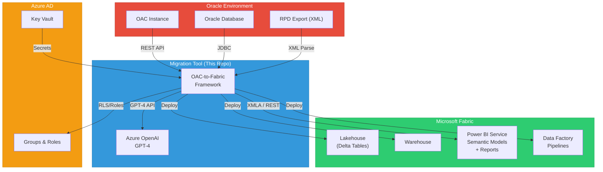

---

## 3. 🔍 Phase 1 — Discovery

> **Agent**: 01 — Discovery & Inventory

```bash
python -m src.cli.main discover --config migration.toml
```

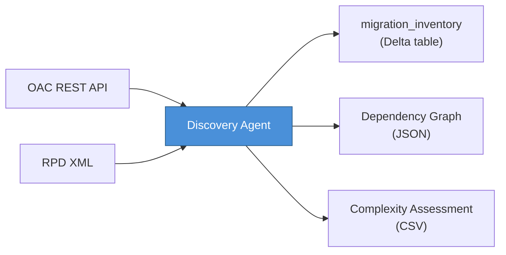

**Expected output:**
- `migration_inventory` Delta table populated in Fabric Lakehouse
- Dependency graph JSON
- Complexity assessment CSV

**✅ Verification checklist:**

| Check | Command / Action |
|:------|:-----------------|
| ☐ All subject areas discovered | Review inventory table |
| ☐ All analyses & dashboards listed | `SELECT COUNT(*) FROM migration_inventory WHERE asset_type IN ('analysis','dashboard')` |
| ☐ Physical table count matches Oracle | Compare with `dba_tables` count |
| ☐ Data flows captured | Verify step counts per flow |
| ☐ No RPD parse errors | Check `agent_logs` for errors |

---

## 4. 🗄️ Phase 2 — Schema Migration

> **Agent**: 02 — Schema & Data Model

```bash
python -m src.cli.main migrate --agents 02-schema --config migration.toml
```

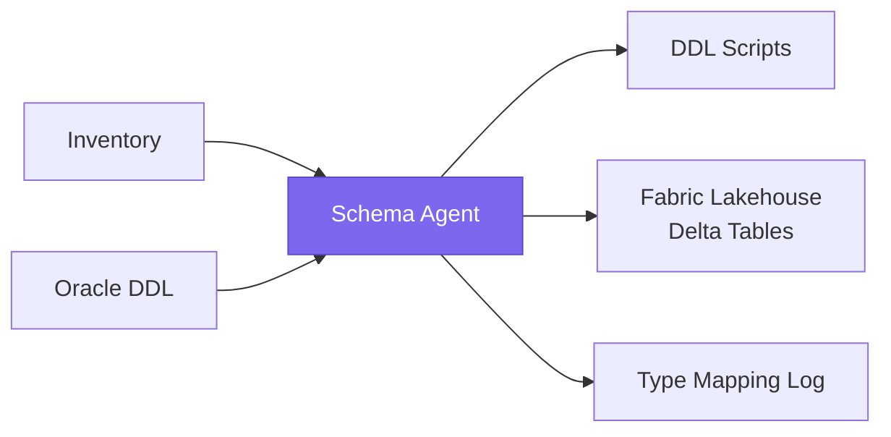

**Type mapping examples:**

| Oracle Type | Fabric Type |
|:------------|:------------|
| `NUMBER(10)` | `bigint` |
| `VARCHAR2(100)` | `string` |
| `DATE` | `timestamp` |
| `CLOB` | `string` |
| `RAW` | `binary` |

**✅ Verification:**
- ☐ DDL scripts generated in `output/ddl/`
- ☐ Tables visible in Fabric Lakehouse
- ☐ Data types correctly mapped (check `mapping_rules` table)
- ☐ No unmapped Oracle types (review warnings)

---

## 5. 🔄 Phase 3 — ETL Pipeline Migration

> **Agent**: 03 — ETL/Data Pipeline

```bash
python -m src.cli.main migrate --agents 03-etl --config migration.toml
```

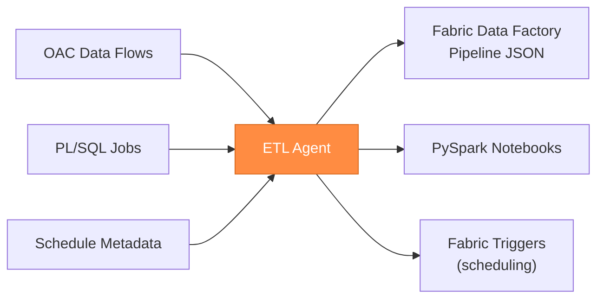

**✅ Verification:**
- ☐ Pipeline JSON in `output/pipelines/`
- ☐ PySpark notebooks in `output/notebooks/`
- ☐ No untranslatable PL/SQL blocks (review warnings)
- ☐ Scheduling metadata preserved

---

## 6. 📐 Phase 4 — Semantic Model Migration

> **Agent**: 04 — Semantic Model

```bash
python -m src.cli.main migrate --agents 04-semantic --config migration.toml
```

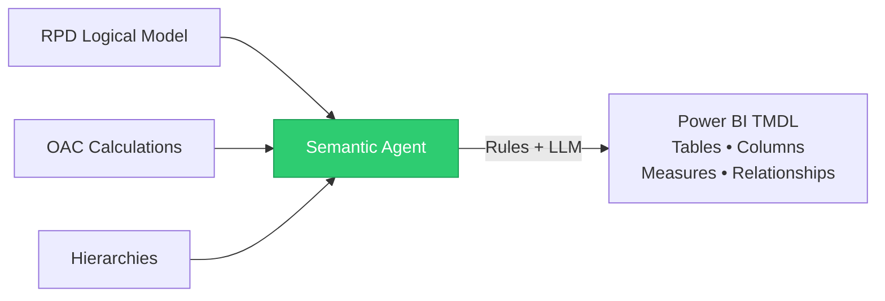

**Translation engine flow:**

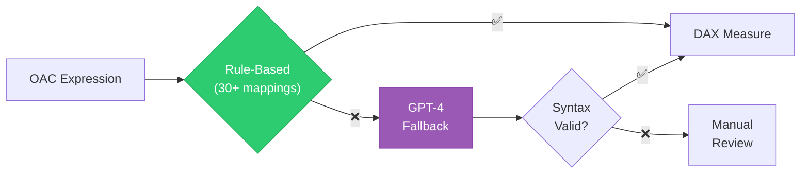

**✅ Verification:**
- ☐ TMDL files in `output/semantic_model/`
- ☐ Tables, columns, and relationships present
- ☐ DAX measures generated for all calculated columns
- ☐ Hierarchies preserved
- ☐ Open in Tabular Editor to verify

---

## 7. 📊 Phase 5 — Report Migration

> **Agent**: 05 — Report & Dashboard

```bash
python -m src.cli.main migrate --agents 05-report --config migration.toml
```

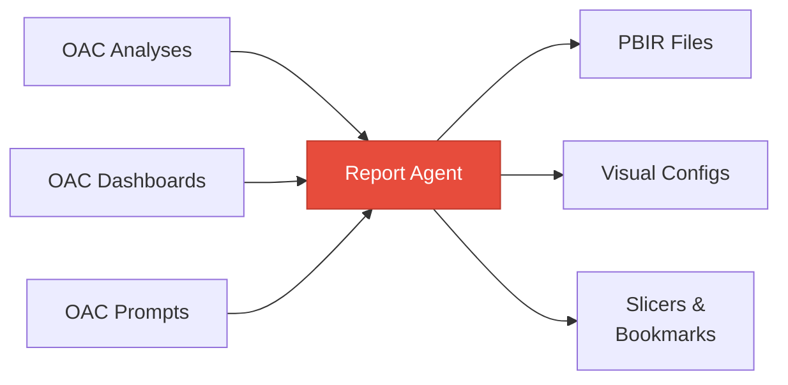

**Visual type mapping:**

| OAC Visual | Power BI Visual |
|:-----------|:----------------|
| Pivot Table | Matrix |
| Bar/Column Chart | Clustered Column |
| Line Chart | Line Chart |
| Pie Chart | Pie Chart |
| Gauge | Gauge |
| Map | Azure Map |
| KPI | Card / KPI |

**✅ Verification:**
- ☐ PBIR files in `output/reports/`
- ☐ Visual types mapped correctly
- ☐ Slicers created from OAC prompts
- ☐ Page layouts approximate OAC dashboards
- ☐ Deploy to PBI Service and visually compare

---

## 8. 🔒 Phase 6 — Security Migration

> **Agent**: 06 — Security & Governance

```bash
python -m src.cli.main migrate --agents 06-security --config migration.toml
```

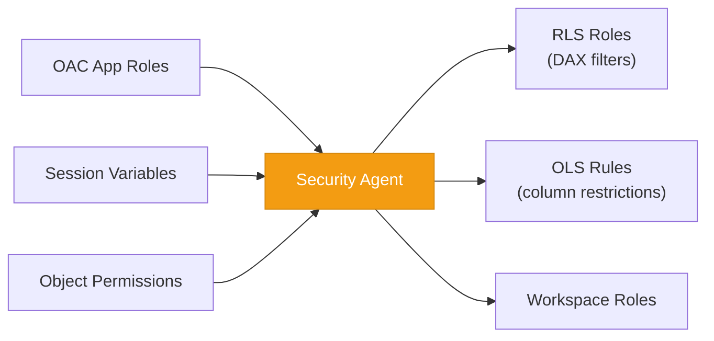

**Security mapping:**

| OAC Concept | Power BI Equivalent |
|:------------|:--------------------|
| Application Role | Workspace Role + RLS Role |
| Session Variable Filter | RLS DAX filter (`USERPRINCIPALNAME()`) |
| Object Permission | Object-Level Security (OLS) |
| Data-Level Security | Row-Level Security (RLS) |

**✅ Verification:**
- ☐ RLS roles defined in semantic model
- ☐ OLS column restrictions applied
- ☐ Workspace roles assigned
- ☐ Test with different user accounts

---

## 9. ✅ Phase 7 — Validation

> **Agent**: 07 — Validation & Testing

```bash
python -m src.cli.main validate --config migration.toml
```

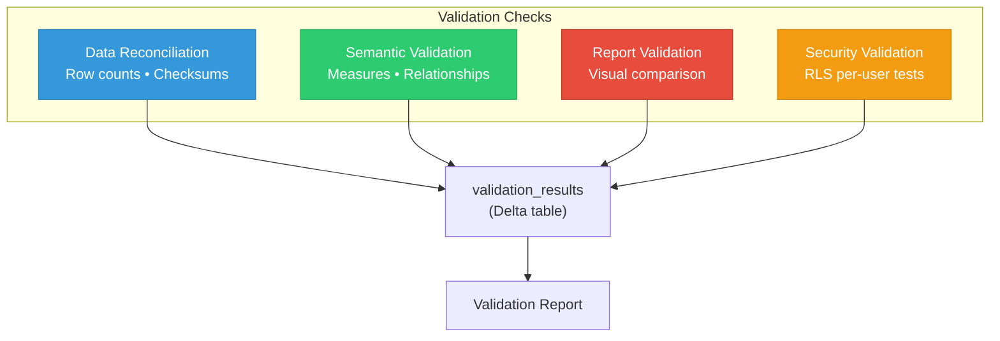

**✅ Verification:**
- ☐ Row count reconciliation passes (±1%)
- ☐ Measure values match within tolerance
- ☐ RLS produces correct filtered results per user
- ☐ All results written to `validation_results` Delta table

---

## 10. 🚀 Phase 8 — Cutover & Go-Live

### Full Migration Run

```bash
python -m src.cli.main migrate --config migration.toml
```

### Go-Live Timeline

```mermaid
gantt
    title Cutover Weekend Plan
    dateFormat HH:mm
    axisFormat %H:%M

    section Friday
    Freeze OAC changes          :f1, 18:00, 1h
    Final data sync             :f2, after f1, 2h
    Run full migration          :crit, f3, after f2, 4h

    section Saturday
    Validation suite            :s1, 01:00, 3h
    Fix any issues              :s2, after s1, 3h
    UAT with key users          :s3, 08:00, 4h

    section Sunday
    Final sign-off              :su1, 09:00, 2h
    Switch DNS / URLs           :crit, su2, after su1, 1h
    Monitor                     :su3, after su2, 4h
    Go / No-Go decision         :milestone, after su3, 0h
```

### 📋 Go-Live Checklist

| Category | Check | Status |
|:---------|:------|:------:|
| **Data** | All validation tests pass | ☐ |
| **Data** | Row counts match ±1% | ☐ |
| **Reports** | Visual comparison approved | ☐ |
| **Security** | RLS tested per role | ☐ |
| **Users** | UAT complete, sign-off received | ☐ |
| **Training** | Materials distributed | ☐ |
| **Access** | OAC set to read-only | ☐ |
| **Access** | PBI reports shared with end users | ☐ |
| **Monitoring** | App Insights dashboards active | ☐ |
| **Rollback** | Rollback plan documented & tested | ☐ |

---

## 11. 🔧 Troubleshooting

| Issue | Solution |
|:------|:---------|
| RPD parse error | Check XML encoding, run with `--log-level DEBUG` |
| 429 rate limit from OAC API | Reduce `--concurrency` setting |
| TMDL deployment fails | Verify XMLA endpoint enabled on Fabric capacity |
| DAX measure compilation error | Run `src/tools/dax_validator.py` on output, review DAX001–DAX014 errors |
| TMDL structure issues | Run `src/tools/tmdl_file_validator.py` to check output directory structure |
| Data type mismatch | Check `mapping_rules` table, add custom mapping |
| RLS not working | Verify DAX filter syntax, check `USERPRINCIPALNAME()` |
| Checkpoint resume fails | Delete `.checkpoint/` directory and restart |
| LLM translation poor quality | Review prompt templates in `src/core/prompt_templates.py` |
| Deployment naming errors | Run `src/tools/fabric_dry_run.py` to validate naming before deploy |

### Pre-Deployment Validation (v8.0 Tooling)

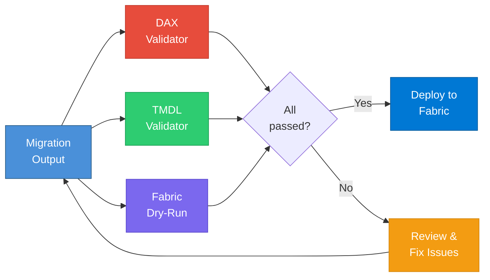

### Diagnostic Commands

```bash
# Verbose logging
python -m src.cli.main migrate --config migration.toml --log-level DEBUG

# Check agent logs
# → query agent_logs Delta table in Fabric

# View migration status
python -m src.cli.main status --config migration.toml

# Start dashboard for visual monitoring
uvicorn src.api.app:app --port 8000
cd dashboard && npm run dev
```

### Getting Help

| Resource | Location |
|:---------|:---------|
| OAC API quirks | `docs/oac-api-notes.md` |
| Credential setup | `docs/security.md` |
| Agent diagnostics | `agent_logs` Delta table |
| Architecture decisions | `docs/adrs/` |
| Operational runbooks | `docs/runbooks/` |
| Essbase migration | `ESSBASE_MIGRATION_PLAYBOOK.md` |
| Smart View → Excel | `SMART_VIEW_TO_EXCEL_MIGRATION.md` |
| Essbase architecture | `ESSBASE_TO_FABRIC_MIGRATION_PROPOSAL.md` |

---

<p align="center">
  <sub>Happy migrating! 🎉</sub>
</p>
