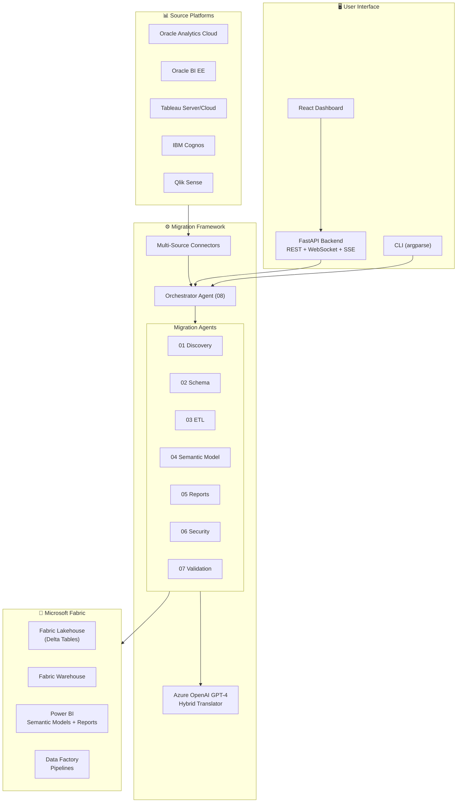
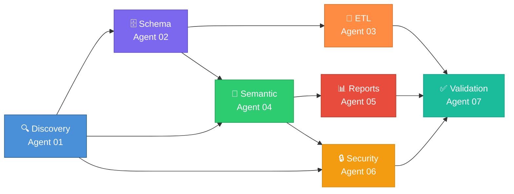
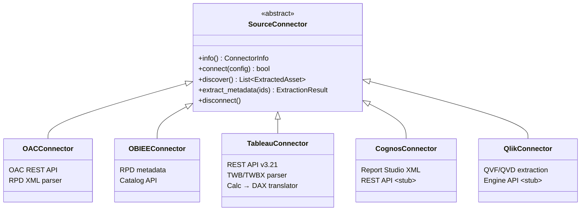
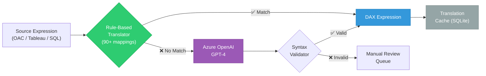
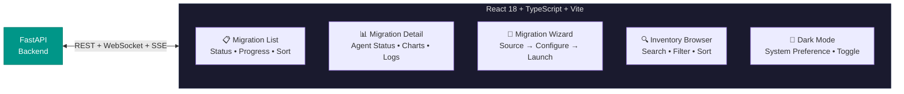
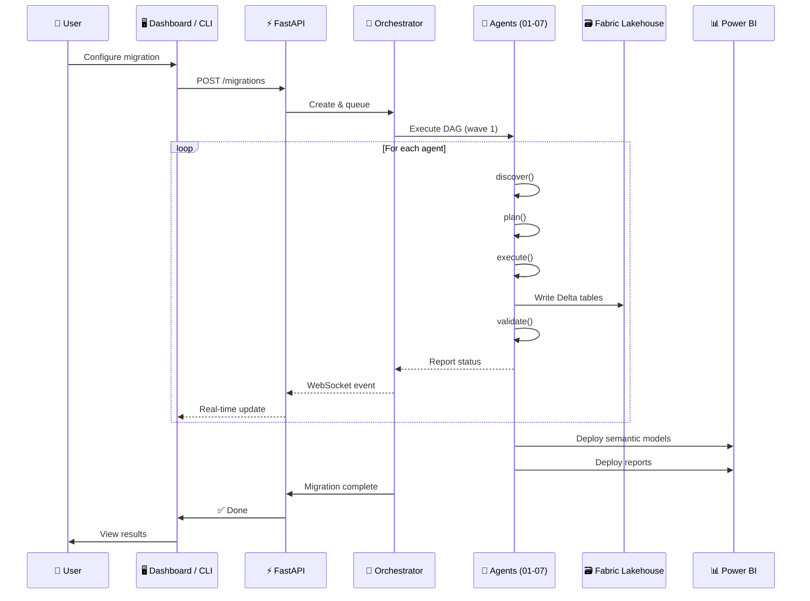
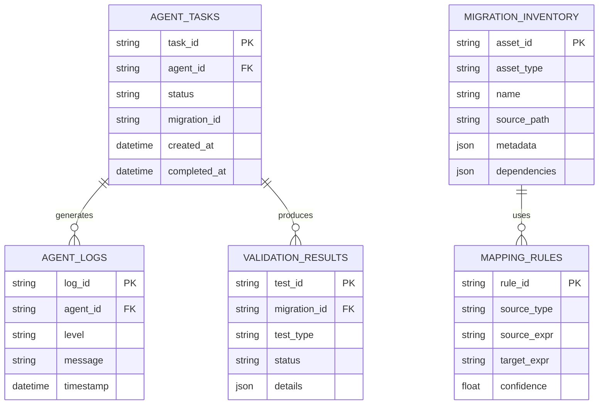
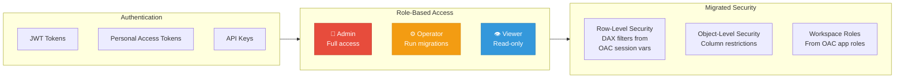
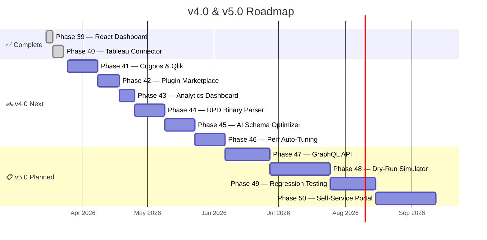

<p align="center">
  
  
  
  
  
  
</p>

<h1 align="center">🔄 OAC → Microsoft Fabric & Power BI</h1>
<h3 align="center">Enterprise-Grade Multi-Agent Migration Framework</h3>

<p align="center">
  Automate end-to-end migration from <strong>Oracle Analytics Cloud</strong> to<br/>
  <strong>Microsoft Fabric</strong> and <strong>Power BI</strong> using 8 specialized AI-powered agents.
</p>

---

## ✨ Why This Tool?

| Challenge | How We Solve It |
|:----------|:----------------|
| Manual migration takes months | **8 specialized agents** automate every layer |
| Expression translation is error-prone | **AI-assisted translator** — rules-first with GPT-4 fallback (90+ DAX mappings) |
| No visibility into progress | **React dashboard** with real-time WebSocket/SSE streaming |
| Security rules get lost | **Automated RLS/OLS** generation from OAC session variables |
| Rollback is impossible | **Incremental waves** with full checkpoint & rollback support |
| Locked into one source | **Multi-source connectors** — OAC, OBIEE, Tableau, Cognos, Qlik |

---

## 🏗️ Architecture Overview



---

## 🤖 Agent Pipeline

Each migration flows through **8 specialized agents** orchestrated as a DAG:



Every agent implements four lifecycle methods:

```python
class MigrationAgent(ABC):
    async def discover(self, scope) -> Inventory         # Find source assets
    async def plan(self, inventory) -> MigrationPlan     # Create migration plan
    async def execute(self, plan) -> MigrationResult     # Execute migration
    async def validate(self, result) -> ValidationReport # Verify correctness
```

---

## 🔌 Multi-Source Connector Framework

Connect to any supported BI platform through a uniform interface:



| Platform | Status | Capabilities |
|:---------|:------:|:-------------|
| **Oracle Analytics Cloud** | ✅ Full | REST API, RPD parsing, catalog discovery |
| **Oracle BI EE** | ✅ Full | RPD metadata extraction, catalog API |
| **Tableau** | ✅ Full | REST API, TWB/TWBX parsing, 55+ calc→DAX rules |
| **IBM Cognos** | 🔲 Stub | Planned for Phase 41 |
| **Qlik Sense** | 🔲 Stub | Planned for Phase 41 |

---

## 🧠 Expression Translation Engine

The **Hybrid Translator** uses a rules-first approach with LLM fallback for complex expressions:



**Coverage:**

| Source | Functions Mapped | Confidence |
|:-------|:----------------:|:----------:|
| OAC → DAX | 30+ | 95% auto |
| Tableau → DAX | 55+ | 85% auto |
| Oracle SQL → Fabric SQL | 30+ | 90% auto |
| LOD / Table calcs | — | Manual review |

---

## 🖥️ User Interfaces

### React Dashboard

A full-featured SPA for managing migrations:



### CLI

```bash
# Discover source assets
oac-migrate discover --config migration.toml

# Generate migration plan
oac-migrate plan --config migration.toml --waves 3

# Run full migration
oac-migrate migrate --config migration.toml

# Validate results
oac-migrate validate --config migration.toml

# Check status
oac-migrate status --config migration.toml
```

### REST API

| Method | Endpoint | Purpose |
|:------:|:---------|:--------|
| `POST` | `/migrations` | Create new migration |
| `GET` | `/migrations` | List all migrations |
| `GET` | `/migrations/{id}` | Get migration status |
| `GET` | `/migrations/{id}/inventory` | Browse discovered assets |
| `GET` | `/migrations/{id}/logs` | Stream logs (SSE) |
| `POST` | `/migrations/{id}/cancel` | Cancel migration |
| `WS` | `/ws/migrations/{id}` | Real-time events |
| `GET` | `/health` | Health check |

---

## 📂 Project Structure

```
OACToFabric/
├── 📄 README.md                 ← You're here
├── 📄 AGENTS.md                 # Agent architecture & definitions
├── 📄 DEV_PLAN.md               # Development plan (Phases 0–50)
├── 📄 MIGRATION_PLAYBOOK.md     # Step-by-step production guide
├── 📄 CONTRIBUTING.md           # Contributor guide
├── 📄 CHANGELOG.md              # Release history
├── 📄 PROJECT_PLAN.md           # Master project plan
│
├── 🐍 src/
│   ├── core/                    # 35 modules — config, models, LLM, telemetry
│   ├── agents/                  # 8 agents × ~5 modules each
│   │   ├── discovery/           # OAC crawling, RPD parsing, dependency graph
│   │   ├── schema/              # DDL generation, type mapping, SQL translation
│   │   ├── etl/                 # Dataflow → pipeline, PL/SQL → PySpark
│   │   ├── semantic/            # RPD → TMDL, expressions → DAX, hierarchies
│   │   ├── report/              # Visuals, layouts, prompts → slicers (PBIR)
│   │   ├── security/            # Roles → RLS/OLS, workspace permissions
│   │   ├── validation/          # Data reconciliation, semantic + report validation
│   │   └── orchestrator/        # DAG engine, wave planner, notifications
│   ├── api/                     # FastAPI (REST + WebSocket + SSE) + JWT/RBAC auth
│   ├── cli/                     # argparse CLI — 5 commands
│   ├── clients/                 # OAC, Fabric, Power BI API clients
│   ├── connectors/              # Multi-source: OAC, OBIEE, Tableau, Cognos, Qlik
│   ├── deployers/               # Fabric, PBI, Pipeline deployers
│   ├── plugins/                 # Plugin framework & manager
│   ├── testing/                 # Integration test harness, fixture generators
│   └── validation/              # Visual diff, data quality checks
│
├── ⚛️  dashboard/                # React 18 + Vite + TypeScript SPA
│   ├── src/pages/               # MigrationList, Detail, Wizard, InventoryBrowser
│   ├── src/hooks/               # TanStack Query, WebSocket, SSE hooks
│   └── src/context/             # Theme (dark mode) context
│
├── 🧪 tests/                    # 2,108 tests across 88+ files
├── ⚙️  config/                   # TOML configs (dev, migration, prod)
├── 🏗️  infra/                    # Bicep IaC for Azure resources
├── 📚 docs/                     # ADRs, runbooks, API notes
├── 📋 agents/                   # Agent SPEC documents (01–08)
├── 🔧 scripts/                  # Dev setup, deployment scripts
└── 📝 templates/                # Migration checklists
```

---

## 🚀 Quick Start

### Prerequisites

- **Python 3.12+** (3.14 recommended)
- **Node.js 20+** (for dashboard)
- **Azure subscription** with Fabric capacity
- **Azure OpenAI** resource (GPT-4 deployment)

### Installation

```bash
# Clone
git clone <repo-url>
cd OACToFabric

# Python setup
python -m venv .venv
.venv\Scripts\activate          # Windows
pip install -e ".[dev]"

# Dashboard setup
cd dashboard
npm install
npm run dev                     # → http://localhost:5173
```

### Configuration

```toml
# config/migration.toml
[migration]
name = "OAC_to_Fabric_2025"
waves = 3

[oac]
url = "https://your-oac.analytics.ocp.oraclecloud.com"
rpd_path = "./exports/rpd_export.xml"

[fabric]
workspace_id = "<workspace-guid>"
lakehouse_name = "MigrationLakehouse"

[openai]
deployment = "gpt-4"
endpoint = "https://<resource>.openai.azure.com"
```

### Run

```bash
# Full migration
python -m src.cli.main migrate --config config/migration.toml

# Or start the API + React dashboard
uvicorn src.api.app:app --port 8000
cd dashboard && npm run dev
```

---

## 🔄 Data Flow



---

## 📊 Coordination Store

All agents communicate via **Delta tables** in Fabric Lakehouse:



---

## 🛡️ Security & Authentication



---

## 📈 Development Progress



| Phase | Status | Tests | Highlights |
|:------|:------:|------:|:-----------|
| **0–38** | ✅ | 1,871 | Core framework, 8 agents, all deployers, incremental sync |
| **39** | ✅ | +121 | React 18 dashboard (5 pages, dark mode, real-time) |
| **40** | ✅ | +116 | Tableau connector (TWB parser, 55+ calc→DAX rules, REST API) |
| **41** | 🔜 | — | Cognos & Qlik connectors |
| **42–46** | 📋 | — | Plugin marketplace, analytics, RPD binary, AI optimization |
| **47** | 📋 | — | GraphQL API & Federation (Strawberry, subscriptions) |
| **48** | 📋 | — | Migration Dry-Run Simulator (cost/risk estimation) |
| **49** | 📋 | — | Automated Regression Testing (snapshot diffs, drift detection) |
| **50** | 📋 | — | Self-Service Migration Portal (SSO, drag-and-drop, templates) |
| **Total** | | **2,108** | **88+ test files, 2 skipped, 0 failures** |

---

## 🧪 Testing

```bash
# Run all tests
python -m pytest tests/ -v

# Run specific phase
python -m pytest tests/test_phase40_tableau.py -v

# With coverage
python -m pytest tests/ --cov=src --cov-report=html

# Quick summary
python -m pytest tests/ -q
# → 2,108 passed, 2 skipped in ~20s
```

---

## 🔗 Documentation

| Document | Description |
|:---------|:------------|
| [PROJECT_PLAN.md](PROJECT_PLAN.md) | Master project plan, phase timeline |
| [AGENTS.md](AGENTS.md) | Multi-agent architecture, file ownership & handoff protocol |
| [DEV_PLAN.md](DEV_PLAN.md) | Detailed dev plan (Phases 0–50) |
| [MIGRATION_PLAYBOOK.md](MIGRATION_PLAYBOOK.md) | Step-by-step production guide |
| [CONTRIBUTING.md](CONTRIBUTING.md) | How to contribute |
| [CHANGELOG.md](CHANGELOG.md) | Version history & release notes |
| [docs/ARCHITECTURE.md](docs/ARCHITECTURE.md) | System architecture, module responsibilities, data flow |
| [docs/DEPLOYMENT_GUIDE.md](docs/DEPLOYMENT_GUIDE.md) | Fabric/PBI deployment, auth, CI/CD, troubleshooting |
| [docs/MAPPING_REFERENCE.md](docs/MAPPING_REFERENCE.md) | All translation rules — types, SQL, DAX, visuals, security |
| [docs/GAP_ANALYSIS.md](docs/GAP_ANALYSIS.md) | Implementation coverage & priority improvements |
| [docs/KNOWN_LIMITATIONS.md](docs/KNOWN_LIMITATIONS.md) | Current gaps, workarounds & severity ratings |
| [docs/FAQ.md](docs/FAQ.md) | Frequently asked questions |

---

## ⚠️ Known Limitations

| Area | Limitation | Severity | Workaround |
|:-----|:-----------|:--------:|:-----------|
| RPD Parser | XML export only — binary RPD not supported | 🟡 Medium | Export RPD to XML via OAC Admin first |
| DAX Translation | LOD expressions / level-based aggregations — partial | 🟡 Medium | Manual review queue for complex cases |
| Visual Mapping | Custom/third-party OAC plugins — not supported | 🟡 Medium | Map to closest PBI native visual |
| Security | Measure-level OLS — not natively supported in PBI | 🟡 Medium | Use perspectives for conditional visibility |
| Connectors | Cognos & Qlik — stub only | 🔴 High | Planned for Phase 41 |
| Performance | 10K+ assets — sequential agent execution may be slow | 🟡 Medium | Use wave-based migration with parallelism |

> **Full details**: [docs/KNOWN_LIMITATIONS.md](docs/KNOWN_LIMITATIONS.md)

---

## 🏛️ Key Design Principles

> **Automation-first** — Every migration step that can be automated, should be.
>
> **Agent specialization** — Each agent owns one migration domain end-to-end.
>
> **Orchestrated workflow** — DAG-based execution with dependency tracking.
>
> **Validation at every stage** — No step is "done" without automated verification.
>
> **Incremental & reversible** — Migrate in waves with full checkpoint & rollback.
>
> **Multi-source ready** — Not just OAC — Tableau, OBIEE, Cognos, Qlik too.

---

<p align="center">
  <sub>Built with ❤️ for enterprise BI migration</sub>
</p>
