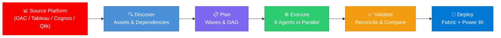
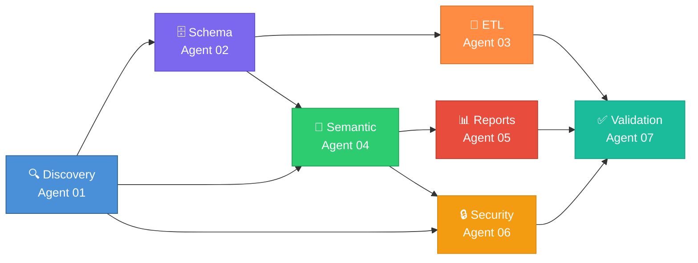
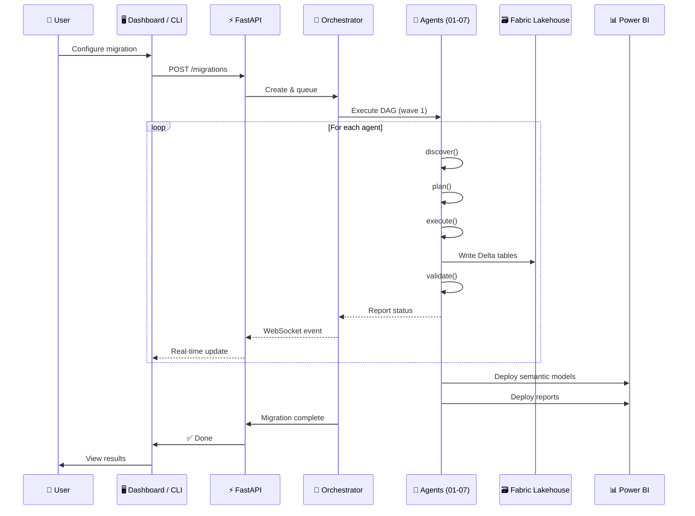
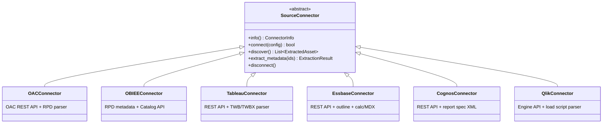

<p align="center">
  
  
  
  
</p>

<p align="center">
  
  
  
  
</p>

<h1 align="center">OAC → Microsoft Fabric & Power BI</h1>

<p align="center">
  Migrate Oracle Analytics Cloud to Microsoft Fabric & Power BI — fully automated,<br/>
  8 AI-powered agents, zero manual rework.
</p>

<p align="center">
  <a href="#-quick-start">Quick Start</a> •
  <a href="#-key-features">Features</a> •
  <a href="#-how-it-works">How It Works</a> •
  <a href="#-expression-translation-300-rules">DAX Mappings</a> •
  <a href="#-cli-reference">CLI</a> •
  <a href="#-documentation">Docs</a>
</p>

---

## ⚡ Quick Start

```bash
# That's it. One command.
oac-migrate migrate --config config/migration.toml
```

> [!TIP]
> The output is deployed to Microsoft Fabric — Lakehouse tables, semantic models (TMDL), and Power BI reports (PBIR).

<details>
<summary>📦 Installation</summary>

```bash
# Clone & setup
git clone https://github.com/cyphou/OACToFabric.git
cd OACToFabric
python -m venv .venv
.venv\Scripts\activate          # Windows
pip install -e ".[dev]"
```

</details>

### More ways to migrate

```bash
# 🔍 Discovery only — inventory all OAC assets
oac-migrate discover --config config/migration.toml

# 📋 Plan waves — see what will be migrated, without executing
oac-migrate plan --config config/migration.toml

# 🚀 Full migration with dry-run preview
oac-migrate migrate --config config/migration.toml --dry-run

# ✅ Validate migration results
oac-migrate validate --config config/migration.toml

# 📊 Check migration progress
oac-migrate status --config config/migration.toml

# 🔌 Plugin marketplace — list / install / publish plugins
oac-migrate marketplace list

# 📈 Export migration analytics
oac-migrate analytics --format powerbi

# ⚡ AI-assisted schema optimization
oac-migrate optimize --lakehouse MigrationLakehouse

# 🎯 Performance auto-tuning
oac-migrate tune --lakehouse MigrationLakehouse

# 🖥️ Start the API + React dashboard
uvicorn src.api.app:app --port 8000
cd dashboard && npm run dev     # → http://localhost:5173
```

---

## 🎯 Key Features

| 🤖 8 Specialized AI Agents | 🔌 6 Source Connectors |
| :--- | :--- |
| Discovery, Schema, ETL, Semantic Model, Reports, Security, Validation, and Orchestrator — each agent owns one migration domain end-to-end with discover → plan → execute → validate lifecycle. DAG-based orchestration with wave planning, retry logic, and checkpoint/rollback. | OAC, OBIEE, Tableau, Essbase, IBM Cognos, Qlik Sense — uniform `SourceConnector` interface. Each connector extracts metadata, translates expressions to DAX, and feeds the semantic bridge for TMDL generation. |

| 🧮 300+ DAX Conversion Rules | 🧠 Hybrid AI Translation |
| :--- | :--- |
| OAC expressions (30+), Tableau calculations (55+), Essbase calc scripts (55+), Essbase MDX (24+), Cognos report expressions (50+), Qlik set analysis & aggregations (72+), Oracle SQL→Fabric SQL (30+). All with confidence scoring. | Rules-first with Azure OpenAI GPT-4 fallback. 90%+ of expressions translate automatically via deterministic rules. Complex edge cases route to LLM with syntax validation. SQLite translation cache for performance. |

| 📊 React Dashboard & REST API | 🛡️ Security Migration |
| :--- | :--- |
| React 18 + TypeScript SPA with 5 pages (Migration List, Detail, Wizard, Inventory Browser, dark mode). FastAPI backend with REST + WebSocket + SSE streaming. JWT/API key auth with RBAC (Admin, Operator, Viewer). | OAC session variables → Power BI RLS (DAX filters). OAC object permissions → OLS. OAC application roles → Fabric workspace roles. Full security audit with credential leak detection. |

| 🔄 Incremental & Reversible | ⚡ AI Schema Optimization |
| :--- | :--- |
| Wave-based migration with full checkpoint support. Resume from last completed agent. Rollback any wave. Multi-tenant isolation. Delta table coordination store in Fabric Lakehouse — no extra Azure services. | AI-assisted partition key recommendations (cardinality scoring), storage mode advisor (Import vs DirectLake vs Dual), Fabric SKU capacity sizing (F2–F1024), column pruning for wide tables, data type optimization. |

| 🔌 Plugin Marketplace | 📈 Migration Analytics |
| :--- | :--- |
| Extensible plugin framework with 8 lifecycle hooks (PRE/POST for Discover, Translate, Deploy, Validate). Built-in plugins for visual mapping overrides and data quality checks. JSON-backed registry with publish/install/uninstall. | Real-time metrics collection with agent progress, wave tracking, and cost analysis. Export to JSON, CSV, or Power BI template. Executive summary with risk detection (failure rates, budget overruns, critical issues). |

> [!NOTE]
> Zero external services for coordination. The entire agent state lives in Fabric Lakehouse Delta tables alongside your migrated data.

---

## 🔧 How It Works



**Step 1 — Discover**: Crawls OAC (REST API + RPD XML/binary), builds dependency graph, scores complexity.

**Step 2 — Plan**: Groups assets into migration waves, builds DAG with agent dependencies, estimates effort.

**Step 3 — Execute**: 7 agents run in DAG order — Schema (Oracle DDL→Delta), ETL (PL/SQL→PySpark), Semantic Model (RPD→TMDL+DAX), Reports (visuals→PBIR), Security (roles→RLS/OLS).

**Step 4 — Validate**: Row count reconciliation, semantic model comparison, visual diff, RLS testing, performance benchmarks.

**Step 5 — Deploy**: One-click deploy to Fabric Lakehouse + Power BI Service via REST APIs with Azure AD auth.

<details>
<summary>🤖 Agent Pipeline (DAG)</summary>



Every agent implements four lifecycle methods:

```python
class MigrationAgent(ABC):
    async def discover(self, scope) -> Inventory         # Find source assets
    async def plan(self, inventory) -> MigrationPlan     # Create migration plan
    async def execute(self, plan) -> MigrationResult     # Execute migration
    async def validate(self, result) -> ValidationReport # Verify correctness
```

</details>

<details>
<summary>🔄 Data Flow (Sequence Diagram)</summary>



</details>

---

## 🔌 Multi-Source Connectors

| Platform | Status | Expression Rules | Capabilities |
|:---------|:------:|:----------------:|:-------------|
| **Oracle Analytics Cloud** | ✅ Full | 30+ | REST API, RPD XML/binary parsing, catalog discovery |
| **Oracle BI EE** | ✅ Full | — | RPD metadata extraction, catalog API |
| **Tableau** | ✅ Full | 55+ | REST API v3.21, TWB/TWBX parsing, calc→DAX, semantic bridge |
| **Oracle Essbase** | ✅ Full | 79+ | REST API, outline parsing, calc script→DAX, MDX→DAX, filters→RLS |
| **IBM Cognos** | ✅ Full | 50+ | REST API, report spec XML parsing, expression→DAX, semantic bridge |
| **Qlik Sense** | ✅ Full | 72+ | Engine API, load script parsing, set analysis→DAX, semantic bridge |

<details>
<summary>🔌 Connector class diagram</summary>



</details>

---

## 🧮 Expression Translation (300+ Rules)

The **Hybrid Translator** uses a rules-first approach with LLM fallback:

```
┌──────────────────────────────────────────────────────────────────────────┐
│  OAC / Tableau / Cognos / Qlik          →  Power BI DAX                │
├──────────────────────────────────────────────────────────────────────────┤
│  IFNULL([Revenue], 0)                   →  COALESCE([Revenue], 0)      │
│  FILTER("Orders"."Status" = 'Active')   →  CALCULATE(...,              │
│                                              'Orders'[Status]="Active") │
│  ZN(SUM([Sales]))                       →  IF(ISBLANK(SUM([Sales])),   │
│                                              0, SUM([Sales]))           │
│  TIMESTAMPDIFF(day, [Start], [End])     →  DATEDIFF([Start],[End],DAY) │
│  RANK(SUM([Revenue]))                   →  RANKX(ALL(...), SUM(...))   │
│  {FIXED [Region] : SUM([Sales])}        →  CALCULATE(SUM([Sales]),     │
│                                              ALLEXCEPT('T',[Region]))   │
└──────────────────────────────────────────────────────────────────────────┘
```

| Source | Rules | Confidence | Engine |
|:-------|:-----:|:----------:|:-------|
| OAC → DAX | 30+ | 95% auto | Rule-based catalog |
| Tableau → DAX | 55+ | 85% auto | Rule-based + LOD patterns |
| Essbase Calc → DAX | 55+ | 90% auto | Calc script parser |
| Essbase MDX → DAX | 24+ | 85% auto | MDX pattern matcher |
| Cognos → DAX | 50+ | 85% auto | Report spec expression engine |
| Qlik → DAX | 72+ | 80% auto | Set analysis + aggregation rules |
| Oracle SQL → Fabric SQL | 30+ | 90% auto | SQL dialect translator |
| **Complex / Edge cases** | — | — | **Azure OpenAI GPT-4 fallback** |

> **Full reference**: [docs/MAPPING_REFERENCE.md](docs/MAPPING_REFERENCE.md)

---

## 📝 CLI Reference

<details>
<summary>🔧 All CLI commands</summary>

| Command | Description |
|:--------|:------------|
| `oac-migrate discover` | Run Discovery Agent (01) — inventory all OAC assets |
| `oac-migrate plan` | Generate wave plan without executing |
| `oac-migrate migrate` | Full orchestrated migration (all 7 agents) |
| `oac-migrate migrate --dry-run` | Preview migration without executing |
| `oac-migrate migrate --agents 01-discovery,02-schema` | Run specific agents only |
| `oac-migrate migrate --resume` | Resume from last checkpoint |
| `oac-migrate validate` | Run validation suite standalone |
| `oac-migrate status` | Show migration progress |
| `oac-migrate marketplace list\|install\|publish` | Plugin marketplace operations |
| `oac-migrate analytics --format json\|csv\|powerbi` | Export migration analytics |
| `oac-migrate optimize` | AI-assisted schema optimization |
| `oac-migrate tune` | Performance auto-tuning analysis |

**Global flags:**

| Flag | Description |
|:-----|:------------|
| `--config, -c` | Path to TOML config (default: `config/migration.toml`) |
| `--env, -e` | Environment overlay (`dev`, `test`, `prod`) |
| `--output-dir, -o` | Output directory for reports |
| `--verbose, -v` | Enable DEBUG logging |
| `--quiet, -q` | Suppress non-error output |

</details>

---

## 🖥️ User Interfaces

### React Dashboard

5-page SPA: Migration List → Detail → Wizard → Inventory Browser → Dark Mode.

Built with React 18 + TypeScript + Vite + TanStack Query. Real-time updates via WebSocket/SSE.

```bash
cd dashboard && npm install && npm run dev    # → http://localhost:5173
```

### REST API

| Method | Endpoint | Purpose |
|:------:|:---------|:--------|
| `POST` | `/migrations` | Create new migration |
| `GET` | `/migrations` | List all migrations |
| `GET` | `/migrations/{id}` | Get status + details |
| `GET` | `/migrations/{id}/inventory` | Browse discovered assets |
| `GET` | `/migrations/{id}/logs` | Stream logs (SSE) |
| `POST` | `/migrations/{id}/cancel` | Cancel migration |
| `WS` | `/ws/migrations/{id}` | Real-time events |
| `GET` | `/health` | Health check |

---

## 📂 Generated Output

```
output/
├── discovery/
│   └── discovery_inventory.md              ← Asset inventory + dependency graph
├── schema/
│   ├── ddl/                                ← CREATE TABLE (Delta format)
│   └── type_mapping_log.json               ← Oracle → Fabric type map
├── etl/
│   ├── pipelines/                          ← Fabric Data Factory JSON
│   ├── notebooks/                          ← PySpark notebooks
│   └── schedules/                          ← Fabric triggers
├── semantic/
│   └── definition/
│       ├── model.tmdl                      ← Tables, measures, relationships
│       ├── expressions.tmdl                ← Power Query M queries
│       └── tables/
│           ├── DimCustomer.tmdl            ← Columns + DAX measures
│           └── Calendar.tmdl              ← Auto-generated date table
├── reports/
│   └── definition/
│       ├── report.json                     ← PBIR report config
│       └── pages/
│           └── Overview/
│               ├── page.json               ← Layout + filters
│               └── visuals/
│                   └── [id]/visual.json    ← Each visual definition
├── security/
│   ├── rls_roles.json                      ← Row-Level Security (DAX filters)
│   ├── ols_rules.json                      ← Object-Level Security
│   └── workspace_roles.json                ← Fabric workspace role assignments
├── validation/
│   ├── reconciliation_report.md            ← Row counts, checksums
│   └── semantic_validation.json            ← Model comparison results
└── orchestrator/
    └── migration_summary.md                ← Overall status + timing
```

<details>
<summary>📁 Project structure</summary>

```
OACToFabric/
├── 📄 README.md                 ← You're here
├── 📄 AGENTS.md                 # 8-agent architecture & handoff protocol
├── 📄 DEV_PLAN.md               # Development plan (Phases 0–50)
├── 📄 MIGRATION_PLAYBOOK.md     # Step-by-step production guide
├── 📄 CONTRIBUTING.md           # Contributor guide
├── 📄 CHANGELOG.md              # Release history
│
├── 🐍 src/
│   ├── core/                    # 38 modules — config, models, LLM, telemetry,
│   │                            #   RPD binary parser, schema optimizer, perf tuner
│   ├── agents/                  # 8 agents × ~5 modules each
│   │   ├── discovery/           # OAC crawling, RPD parsing, dependency graph
│   │   ├── schema/              # DDL generation, type mapping, SQL translation
│   │   ├── etl/                 # Dataflow → pipeline, PL/SQL → PySpark
│   │   ├── semantic/            # RPD → TMDL, expressions → DAX, hierarchies
│   │   ├── report/              # Visuals, layouts, prompts → slicers (PBIR)
│   │   ├── security/            # Roles → RLS/OLS, workspace permissions
│   │   ├── validation/          # Data reconciliation, semantic + report validation
│   │   └── orchestrator/        # DAG engine, wave planner, notifications
│   ├── api/                     # FastAPI (REST + WebSocket + SSE) + JWT/RBAC
│   ├── cli/                     # argparse CLI — 9 commands
│   ├── clients/                 # OAC, Fabric, Power BI API clients
│   ├── connectors/              # 6 connectors: OAC, OBIEE, Tableau, Essbase, Cognos, Qlik
│   ├── deployers/               # Fabric, PBI, Pipeline deployers
│   ├── plugins/                 # Plugin framework, marketplace, analytics dashboard
│   ├── testing/                 # Integration test harness
│   └── validation/              # Visual diff, data quality checks
│
├── ⚛️  dashboard/                # React 18 + Vite + TypeScript SPA
├── 🧪 tests/                    # 2,618 tests across 95+ files
├── ⚙️  config/                   # TOML configs (dev, migration, prod)
├── 🏗️  infra/                    # Bicep IaC for Azure resources
├── 📚 docs/                     # ADRs, runbooks, guides
├── 📋 agents/                   # Agent SPEC documents (01–08)
└── 🔧 scripts/                  # Dev setup, deployment scripts
```

</details>

---

## 🚀 Deployment

<details>
<summary>☁️ Microsoft Fabric</summary>

```toml
# config/migration.toml
[fabric]
workspace_id = "<workspace-guid>"
lakehouse_name = "MigrationLakehouse"

[openai]
deployment = "gpt-4"
endpoint = "https://<resource>.openai.azure.com"
```

```bash
oac-migrate migrate --config config/migration.toml
```

Deploys: Lakehouse (Delta tables) + Semantic Model (TMDL) + Reports (PBIR) + Data Factory Pipelines.

</details>

<details>
<summary>⚙️ Configuration</summary>

```toml
# config/migration.toml
[migration]
environment = "dev"
output_dir = "output"
log_level = "INFO"

[scope]
include_paths = ["/shared"]
exclude_paths = ["/shared/archive"]
asset_types = []                    # empty = all types

[orchestrator]
max_retries = 3
parallel_agents_per_wave = 3
max_items_per_wave = 50
validate_after_each_wave = true

[llm]
enabled = false                     # Enable for GPT-4 fallback
model = "gpt-4"
temperature = 0.1
cache_enabled = true

[marketplace]
enabled = true
registry_path = "plugins/registry.json"

[schema_optimizer]
ai_enabled = true
direct_lake_threshold_gb = 10

[perf_auto_tuner]
scan_threshold_rows = 1_000_000
slow_query_threshold_seconds = 5
```

</details>

---

## ✅ Validation

```python
from src.agents.validation.validation_agent import ValidationAgent

agent = ValidationAgent(config=agent_config)
report = await agent.validate(migration_result)
# → {"status": "PASSED", "checks": 42, "failures": 0, "warnings": 2}
```

The validation agent checks:
- **Data reconciliation** — row counts, checksums, sample queries
- **Semantic model** — tables, columns, measures, relationships match
- **Report structure** — pages, visuals, slicers, formatting
- **Security** — RLS filters produce correct results per role
- **Performance** — query benchmarks against baseline

---

## 🧪 Testing

<p align="center">
  
  
  
</p>

```bash
python -m pytest tests/ -v                        # Run all 2,618 tests
python -m pytest tests/test_expression_translator.py -v  # Specific module
python -m pytest tests/ --cov=src --cov-report=html      # Coverage report
python -m pytest tests/ -q                        # Quick → 2,618 passed, 2 skipped in ~12s
```

<details>
<summary>📋 Test suite breakdown</summary>

| Phase | Status | Tests | Highlights |
|:------|:------:|------:|:-----------|
| **0–38** | ✅ | 1,871 | Core framework, 8 agents, all deployers, incremental sync, multi-tenant |
| **39** | ✅ | +121 | React 18 dashboard (5 pages, dark mode, real-time WebSocket/SSE) |
| **40** | ✅ | +116 | Tableau connector (TWB parser, 55+ calc→DAX rules, REST API, semantic bridge) |
| **41** | ✅ | +155 | Cognos connector (50+ rules, report spec parser) + Qlik connector (72+ rules, load script parser) |
| **42** | ✅ | +48 | Plugin marketplace (registry, installer, visual override & data quality plugins) |
| **43** | ✅ | +31 | Migration analytics dashboard (metrics collector, CSV/JSON/PBIT export) |
| **44** | ✅ | +38 | RPD binary parser (streaming, large-file support, binary→XML converter) |
| **45** | ✅ | +27 | AI schema optimizer (partition key, storage mode, capacity sizing, column pruning) |
| **46** | ✅ | +39 | Performance auto-tuner (DAX optimizer, aggregation advisor, composite model advisor) |
| **Total** | | **2,618** | **95+ test files, 2 skipped, 0 failures, 0 warnings** |

</details>

---

## 📚 Documentation

| Document | Description |
|:---------|:------------|
| 📋 [PROJECT_PLAN.md](PROJECT_PLAN.md) | Master project plan & phase timeline |
| 🤖 [AGENTS.md](AGENTS.md) | 8-agent architecture, file ownership & handoff protocol |
| 🗓️ [DEV_PLAN.md](DEV_PLAN.md) | Detailed dev plan (Phases 0–50) |
| 📖 [MIGRATION_PLAYBOOK.md](MIGRATION_PLAYBOOK.md) | Step-by-step production migration guide |
| 🤝 [CONTRIBUTING.md](CONTRIBUTING.md) | How to contribute |
| 📝 [CHANGELOG.md](CHANGELOG.md) | Version history & release notes |
| 🏗️ [docs/ARCHITECTURE.md](docs/ARCHITECTURE.md) | System architecture & data flow |
| 🚀 [docs/DEPLOYMENT_GUIDE.md](docs/DEPLOYMENT_GUIDE.md) | Fabric/PBI deployment, auth, CI/CD |
| 🔢 [docs/MAPPING_REFERENCE.md](docs/MAPPING_REFERENCE.md) | All translation rules — types, SQL, DAX, visuals |
| 📊 [docs/GAP_ANALYSIS.md](docs/GAP_ANALYSIS.md) | Implementation coverage & improvements |
| ⚠️ [docs/KNOWN_LIMITATIONS.md](docs/KNOWN_LIMITATIONS.md) | Current gaps & workarounds |
| ❓ [docs/FAQ.md](docs/FAQ.md) | Frequently asked questions |
| 🔐 [docs/security.md](docs/security.md) | Credentials, data handling, LLM security |

---

## ⚠️ Known Limitations

- `MAKEPOINT()` / spatial expressions have no DAX equivalent — skipped with warning
- LOD / level-based aggregations are partially supported — complex cases go to manual review queue
- Custom/third-party OAC visual plugins are not mapped — closest PBI native visual used
- Measure-level OLS is not natively supported in PBI — use perspectives instead
- Binary RPD parsing is experimental — XML export is preferred (Phase 44 binary parser available)
- 10K+ assets may be slow with sequential execution — use wave-based parallelism
- See [docs/KNOWN_LIMITATIONS.md](docs/KNOWN_LIMITATIONS.md) for the full list

---

## 🤝 Contributing

Contributions are welcome! See [CONTRIBUTING.md](CONTRIBUTING.md) for guidelines.

```bash
git clone https://github.com/cyphou/OACToFabric.git
cd OACToFabric
python -m pytest tests/ -q    # Make sure tests pass
```

---

## License

MIT

---

<p align="center">
  Built with ❤️ for enterprise BI migration<br/>
  <sub>If this tool saves you time, consider giving it a ⭐</sub>
</p>
