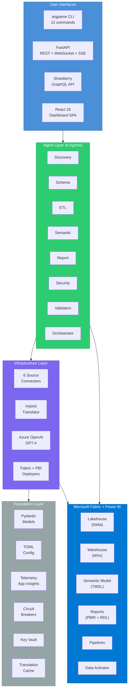
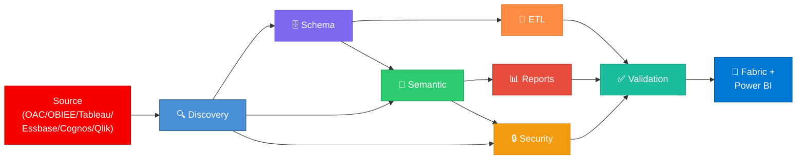

# Architecture — OAC to Fabric & Power BI Migration Framework

> **Version**: v6.0 (Phase 62 complete) · **150 source modules** · **3,559 tests** · **44,600+ LOC**

## High-Level Architecture



## Pipeline Overview

The migration follows a **multi-phase pipeline** driven by 8 specialized agents:



### ASCII Pipeline Diagram

```
              +-------------------------------+
              |           INPUT               |
              |  OAC REST API + RPD XML       |
              |  Oracle Database              |
              |  (+ OBIEE, Tableau, etc.)     |
              +---------------+---------------+
                              |
                              v
              +-------------------------------+
              |    PHASE 1 — DISCOVERY        |
              |   src/agents/discovery/       |
              |                               |
              |  OAC API client + RPD parser  |
              |  Dependency graph builder     |
              |  Complexity scoring           |
              +---------------+---------------+
                              |
                              v
              +-------------------------------+
              |   COORDINATION STORE          |
              |                               |
              |   Fabric Lakehouse (Delta)    |
              |   agent_tasks                 |
              |   migration_inventory         |
              |   mapping_rules               |
              |   validation_results          |
              |   agent_logs                  |
              +---------------+---------------+
                              |
              ┌───────────────┼───────────────┐
              |               |               |
              v               v               v
       +-------------+ +----------+ +-------------+
       | PHASE 2     | | PHASE 3  | | PHASE 4     |
       | Schema      | | ETL      | | Semantic    |
       | Oracle→     | | DataFlow→| | RPD→TMDL    |
       | Fabric DDL  | | Spark    | | OAC→DAX     |
       +------+------+ +----------+ +------+------+
              |                              |
              |                              v
              |                     +-------------+
              |                     | PHASE 5     |
              |                     | Reports     |
              |                     | OAC→PBIR    |
              |                     +------+------+
              |                            |
              |               +------------+
              |               |
              v               v
       +-------------------------------+
       | PHASE 6 — SECURITY            |
       | RLS/OLS, workspace roles      |
       +---------------+---------------+
                       |
                       v
       +-------------------------------+
       | PHASE 7 — VALIDATION          |
       | Data, semantic, report, RLS   |
       | Performance benchmarks        |
       +---------------+---------------+
                       |
                       v
       +-------------------------------+
       |           OUTPUT              |
       |                               |
       |  Fabric Lakehouse (Delta)     |
       |  PBI Semantic Model (TMDL)    |
       |  PBI Reports (PBIR)           |
       |  Data Factory Pipelines       |
       |  RLS/OLS Definitions          |
       +-------------------------------+
```

## Module Responsibilities

### `src/agents/discovery/` — Discovery Layer

| Module | Responsibility |
|--------|---------------|
| `discovery_agent.py` | DiscoveryAgent: crawl OAC, produce inventory |
| `oac_client.py` | OAC API + RPD parser orchestration |
| `rpd_parser.py` | Parse OracleBI.xml; logical model, physical tables, subject areas |
| `dependency_graph.py` | Build asset DAG; detect cycles, topological sort |
| `complexity_scorer.py` | Score items by complexity (LOW/MEDIUM/HIGH) |
| `portfolio_assessor.py` | 5-axis readiness assessment, effort scoring, wave planning |
| `safe_xml.py` | XXE-protected XML parsing, DOCTYPE/ENTITY rejection |
| `incremental_crawler.py` | Delta crawl with `modifiedSince`, inventory diffing (ADDED/MODIFIED/DELETED), snapshot persistence |

### `src/agents/schema/` — Schema Migration Layer

| Module | Responsibility |
|--------|---------------|
| `schema_agent.py` | SchemaAgent: migrate schemas to Fabric Lakehouse |
| `ddl_generator.py` | Generate Fabric DDL (CREATE TABLE, ALTER TABLE) |
| `sql_translator.py` | Oracle PL/SQL → Fabric SQL (30+ type mappings) |
| `type_mapper.py` | Oracle → Fabric data type mapping |
| `pipeline_generator.py` | Generate Fabric Data Factory copy pipelines |
| `fabric_naming.py` | Fabric-safe name sanitization (strip brackets, OAC prefixes, PascalCase/snake_case) |
| `lakehouse_generator.py` | 3-artifact Lakehouse generation (definition, DDL, metadata), 16+ Oracle→Spark type maps |
| `materialized_view_generator.py` | Oracle MV DDL parser, Fabric Warehouse MV generator, refresh mode mapping |
| `mirroring_config_generator.py` | Fabric Mirroring configuration: Oracle connection, table selection, replication schedule |

### `src/agents/etl/` — ETL Migration Layer

| Module | Responsibility |
|--------|---------------|
| `etl_agent.py` | ETLAgent: convert OAC Data Flows to Fabric pipelines |
| `dataflow_parser.py` | Parse OAC Data Flow XML; extract steps, transformations |
| `step_mapper.py` | Map OAC steps to Fabric activities (copy, transform, filter) |
| `plsql_translator.py` | PL/SQL → PySpark/SQL for stored procedures |
| `schedule_converter.py` | OAC scheduler → Fabric trigger/pipeline schedule |
| `fabric_pipeline_generator.py` | 3-stage pipeline orchestration (RefreshDataflow→Notebook→Refresh), 9 JDBC templates |
| `incremental_merger.py` | Safe re-migration merge engine, user-owned file/key preservation |
| `pivot_unpivot_mapper.py` | Pivot/Unpivot → M query + PySpark, column detection, aggregation mapping |
| `error_row_router.py` | Rejected row routing to dead-letter Delta table, error metadata enrichment |

### `src/agents/semantic/` — Semantic Model Layer

| Module | Responsibility |
|--------|---------------|
| `semantic_agent.py` | SemanticModelAgent: RPD → Power BI Semantic Model |
| `rpd_model_parser.py` | Extract logical model: columns, hierarchies, joins |
| `expression_translator.py` | OAC calc expressions → DAX measures (60+ rules) |
| `hierarchy_mapper.py` | Convert OAC hierarchies to Power BI hierarchy objects |
| `tmdl_generator.py` | Generate TMDL (Tabular Model Definition Language) |
| `calendar_generator.py` | Auto-detect date columns → 8-column Calendar table + hierarchy + 3 TI measures |
| `dax_optimizer.py` | 5 DAX optimization rules: ISBLANK→COALESCE, IF→SWITCH, SUMX→SUM, CALCULATE collapse, constant folding |
| `leak_detector.py` | 22 OAC function leak patterns (NVL, DECODE, SYSDATE, VALUEOF, etc.) + auto-fix |
| `tmdl_self_healing.py` | 6 auto-repair patterns: duplicate names, broken refs, orphan measures, empty names, circular rels, M errors |
| `calc_group_generator.py` | Detect time-intel clusters, generate TMDL `calculationGroup` blocks, `calculationItem` DAX |
| `dax_udf_generator.py` | Complex expression → DAX UDF with `DEFINE FUNCTION`, parameter type hints |
| `direct_lake_generator.py` | Direct Lake TMDL emitter: OneLake mode, expression partitions, Lakehouse SQL endpoint |
| `tmdl_incremental.py` | TMDL folder parser, merge engine (additive + modify + tombstone), manual-edit preservation |

### `src/agents/report/` — Report Generation Layer

| Module | Responsibility |
|--------|---------------|
| `report_agent.py` | ReportMigrationAgent: Analyses/Dashboards → PBI Reports |
| `prompt_converter.py` | OAC prompts → Power BI slicers/parameters |
| `visual_mapper.py` | OAC viz types → Power BI visuals |
| `layout_engine.py` | Reconstruct page layouts; positioning, grid alignment |
| `pbir_generator.py` | Generate PBIR (Power BI Report) JSON |
| `visual_fallback.py` | 3-tier visual degradation cascade (complex→simpler→table→card) |
| `bookmark_generator.py` | PBI bookmark JSON from OAC story points and saved filter states |
| `bip_parser.py` | BI Publisher XML data model parser, RTF template extractor |
| `rdl_generator.py` | RDL XML generator (Tablix, Matrix, Chart, List regions), paginated reports |
| `bip_expression_mapper.py` | BI Publisher XSL/XPath expressions → RDL expressions |
| `alert_migrator.py` | OAC Agent parser, Data Activator trigger generator, PBI data alert rules |
| `activator_config.py` | Data Activator Reflex item configuration (event streams, conditions, actions) |
| `task_flow_generator.py` | OAC action classifier, Translytical task flow definition generator |
| `action_link_mapper.py` | OAC action → PBI action type mapping (drillthrough, bookmarks, URL) |
| `visual_calc_mapper.py` | OAC custom aggregation → PBI visual calculations (COLLAPSE, EXPAND) |

### `src/agents/security/` — Security Layer

| Module | Responsibility |
|--------|---------------|
| `security_agent.py` | SecurityMigrationAgent: roles, RLS, permissions |
| `role_mapper.py` | OAC app roles → PBI RLS + Fabric workspace roles |
| `rls_converter.py` | OAC session variables → DAX RLS filter expressions |
| `ols_generator.py` | Object-level security for sensitive tables/columns |
| `governance_engine.py` | Governance rules: naming conventions, 15 PII patterns, 10 credential redaction patterns, sensitivity labels |
| `aad_group_provisioner.py` | Graph API: create security groups, add members, assign to Fabric workspace roles |
| `audit_trail_migrator.py` | OAC audit log parser, Fabric-compatible audit event mapping, compliance report |
| `dynamic_rls_generator.py` | Multi-valued session variable → complex DAX RLS (CONTAINSSTRING, PATHCONTAINS) |

### `src/agents/validation/` — Validation Layer

| Module | Responsibility |
|--------|---------------|
| `validation_agent.py` | ValidationAgent: compare source vs. migrated artifacts |
| `data_reconciliation.py` | Row count, checksum, sample data QA |
| `semantic_validator.py` | Validate semantic model: measures, hierarchies, relationships |
| `report_validator.py` | Visual comparison, slicer tests, bookmarks |
| `security_validator.py` | RLS testing, user-level access verification |
| `tmdl_validator.py` | TMDL structural validation (required files/dirs/keys) + 8-point migration readiness |

### `src/agents/orchestrator/` — Orchestration Layer

| Module | Responsibility |
|--------|---------------|
| `orchestrator_agent.py` | OrchestratorAgent: DAG execution, dependency mgmt |
| `dag_engine.py` | Topological sort, parallel safe execution, retry logic |
| `wave_planner.py` | Multi-wave planning, resource allocation, scheduling |
| `notification_manager.py` | Email/Teams notifications, status reporting |
| `sla_tracker.py` | SLA compliance evaluation (duration, validation, accuracy), breach/at-risk alerts |
| `monitoring.py` | 3-backend metrics export: JSON, Azure Monitor (App Insights), Prometheus |
| `recovery_report.py` | Recovery action tracking: retries, self-heal actions, manual fixes, severity categorization |

### `src/core/` — Shared Core Services

| Module | Responsibility |
|--------|---------------|
| `base_agent.py` | MigrationAgent ABC — lifecycle (discover → plan → execute → validate → rollback) |
| `models.py` | 20+ Pydantic domain models |
| `config.py` | Configuration loader (migration.toml, dev.toml, prod.toml) |
| `expression_translator.py` | Core OAC → DAX rule engine (30+ rules) |
| `hybrid_translator.py` | Rules-first + LLM fallback engine |
| `translation_cache.py` | SQLite deterministic cache for LLM hits |
| `translation_catalog.py` | Expanded DAX function mappings & coverage reporting |
| `llm_client.py` | Azure OpenAI async wrapper; retry, token budgeting |
| `lakehouse_client.py` | Async Delta table client for Fabric Lakehouse |
| `keyvault_provider.py` | Azure Key Vault secret management |
| `telemetry.py` | Structured observability, Application Insights |
| `resilience.py` | Circuit breakers, fallback strategies |
| `checkpoint.py` | State snapshots & resume |
| `streaming_parser.py` | Memory-efficient XML parser for large RPD files |
| `graceful_shutdown.py` | SIGINT/SIGTERM handler with state persistence |

### `src/connectors/` — Multi-Source Connectors

| module | Responsibility |
|--------|---------------|
| `base_connector.py` | SourceConnector ABC |
| `tableau_connector.py` | Full Tableau support — TWB/TWBX parsing, REST API, 55+ calc→DAX |
| `essbase_connector.py` | Full Essbase support — REST API, outline parsing, calc script→DAX, MDX→DAX |
| `essbase_semantic_bridge.py` | Essbase outline → SemanticModelIR for TMDL generation |
| `cognos_connector.py` | IBM Cognos — REST API, report spec XML parsing, 50+ expression→DAX |
| `qlik_connector.py` | Qlik Sense — Engine API, load script parsing, set analysis, 72+ rules |
| OBIEE connector | Oracle BI EE metadata + Catalog API |

### `src/clients/` — External API Clients

| Module | Responsibility |
|--------|---------------|
| `fabric_client.py` | Async REST client for Fabric (workspaces, lakehouses, pipelines) |
| `pbi_client.py` | Power BI REST APIs (semantic model deployment, dataset config) |
| `oac_catalog.py` | OAC catalog discovery endpoints |
| `oac_auth.py` | Multi-method OAC auth (OAuth2, API key, mTLS) |
| `oac_dataflow_api.py` | OAC Data Flow REST API extraction |

### `src/deployers/` — Deployment

| Module | Responsibility |
|--------|---------------|
| `fabric_deployer.py` | Deploy Lakehouse tables, notebooks, pipelines to Fabric |
| `pbi_deployer.py` | Deploy semantic models & reports to Power BI workspaces |
| `pipeline_deployer.py` | Deploy Fabric Data Factory pipelines |

### `src/api/` — REST API

| Module | Responsibility |
|--------|---------------|
| `app.py` | FastAPI application — REST + WebSocket + SSE endpoints |
| `auth.py` | Azure AD (Entra ID) authentication + RBAC |
| `graphql_schema.py` | Strawberry GraphQL schema, real-time subscriptions, field-level auth |
| `dataloaders.py` | DataLoader N+1 prevention for GraphQL queries |

### `src/cli/` — Command-Line Interface

| Module | Responsibility |
|--------|---------------|
| CLI entry points | argparse-based CLI with `--dry-run`, `--wave`, `--config`, `--resume` flags |

### `dashboard/` — React Dashboard

| Stack | Purpose |
|-------|---------|
| React 18 + TypeScript + Vite | Migration wizard, inventory browser, real-time streaming |
| TanStack Query | API state management |

## Data Flow Detail

### Phase 1: Discovery

```
OAC REST API → oac_catalog.py → crawl catalog → Delta table (migration_inventory)
                                      ↓
RPD XML → rpd_parser.py → physical/logical/presentation layers → Delta table
                                      ↓
dependency_graph.py → topological sort → adjacency list (JSON column)
                                      ↓
complexity_scorer.py → weighted score per asset → Delta table
```

### Phase 4: Semantic Model Generation

```
migration_inventory (logical layer) → rpd_model_parser.py
                                            ↓
                                   expression_translator.py
                                   (OAC expression → DAX, 60+ rules)
                                            ↓
                                   hybrid_translator.py
                                   (LLM fallback for unmatched patterns)
                                            ↓
                                   tmdl_generator.py → SemanticModel/
                                          ├── model.tmdl
                                          ├── tables/*.tmdl
                                          ├── relationships.tmdl
                                          ├── roles.tmdl
                                          ├── perspectives.tmdl
                                          └── expressions.tmdl
```

### Phase 5: Report Generation

```
migration_inventory (analyses/dashboards) → report_agent.py
                                                 ↓
                                        visual_mapper.py (21+ visual types)
                                                 ↓
                                        prompt_converter.py (8 prompt types)
                                                 ↓
                                        layout_engine.py (grid → 1280×720 canvas)
                                                 ↓
                                        pbir_generator.py → Report/
                                               ├── definition.pbir
                                               ├── report.json
                                               └── pages/*/visuals/*.json
```

## Technology Stack

| Component | Technology | Rationale |
|-----------|-----------|-----------|
| Backend | Python 3.11+ async/await | Native async, Pydantic models |
| Agent Framework | Custom `MigrationAgent` ABC | Full lifecycle control |
| LLM | Azure OpenAI GPT-4 | Expression translation fallback |
| Translation | Hybrid rules-first + LLM | 90+ deterministic rules for speed/accuracy |
| Data | Apache Spark + Delta Lake | Fabric Lakehouse native |
| Cloud Auth | Azure Entra ID, Key Vault | Enterprise identity |
| Observability | Application Insights, OTLP | Structured tracing |
| Frontend | React 18 + TypeScript + Vite | Modern SPA dashboard |
| IaC | Bicep | Azure-native IaC |
| CI/CD | Azure DevOps + Fabric Git | Promote across dev/test/prod |
| Testing | pytest (3,559 tests, 130 files) | 97% OAC object coverage |

## Key References

| Document | Path |
|----------|------|
| Agent Architecture | [AGENTS.md](../AGENTS.md) |
| Agent SPECs | [agents/01-discovery-agent/SPEC.md](../agents/01-discovery-agent/SPEC.md) … [agents/08-orchestrator-agent/SPEC.md](../agents/08-orchestrator-agent/SPEC.md) |
| Development Plan | [DEV_PLAN.md](../DEV_PLAN.md) |
| Migration Playbook | [MIGRATION_PLAYBOOK.md](../MIGRATION_PLAYBOOK.md) |
| Security | [security.md](security.md) |
| OAC API Notes | [oac-api-notes.md](oac-api-notes.md) |
| ADRs | [adrs/](adrs/) |
| Runbooks | [runbooks/](runbooks/) |
